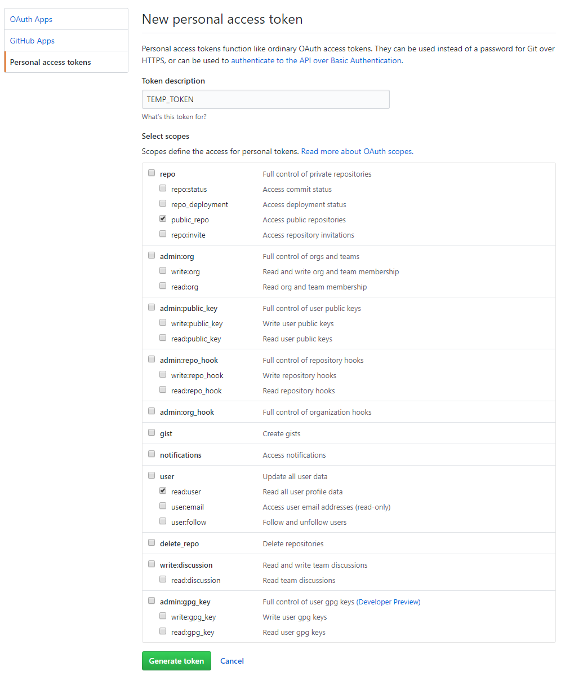
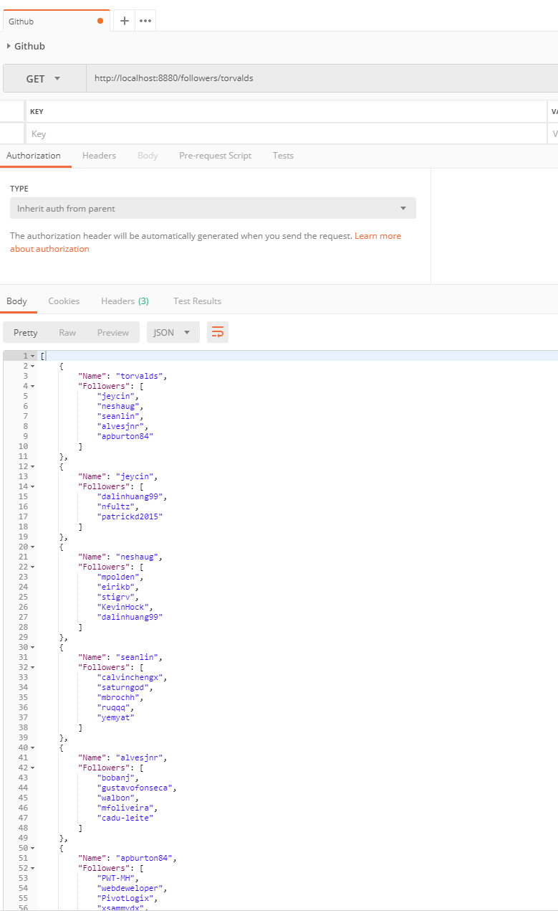
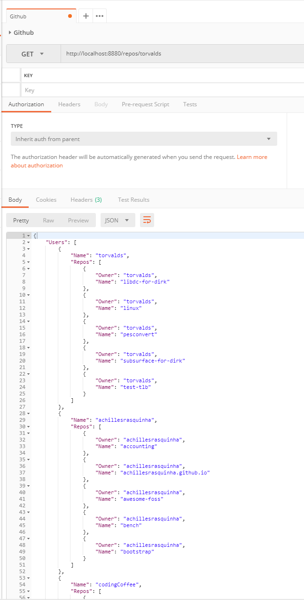

# Golang-API-GitHub

Golang API that returns Github user / stargazer usernames and repositories as well as follower repositories.
Utilizes the [go-github](https://github.com/google/go-github) package to interface with the [Github API](https://developer.github.com/v3/?)

### To Build and Run:
- **NOTE 1:** Port `8880` or the one specified in `docker-compose.yml` and `main.go` must be available.
- **NOTE 2:** On Windows 10 Pro or greater? You can use [Chocolatey](https://chocolatey.org/) to install [Docker CE for Windows](https://chocolatey.org/packages/docker-for-windows/18.06.1.19507) and everything else listed below.

1. Install Golang if you want to run the API on your host machine. If you wish to run the API in a Docker container, you can skip this step.
  - [Golang Download and installation instructions](https://golang.org/dl/)

2. Install Golang dependencies if you want to run the API on your host machine. If you wish to run the API in a Docker container, you can skip this step.
  - `go get github.com/gorilla/context`
  - `go get github.com/gorilla/mux`
  - `go get github.com/google/go-github/github`
  - `go get golang.org/x/oauth2`
  - `go get golang.org/x/net/context/ctxhttp`

3. Install Docker and Docker Compose. If you wish to run the API on your host machine, you can skip this step.
  - [Docker](https://docs.docker.com/install/)
  - [Docker Compose](https://docs.docker.com/compose/install/)

4. [Get a GitHub API key / token with the following permissions](https://github.com/settings/tokens/new)
  

5. Set the token as an environment variable named `TOKEN`
  - **Windows:** `$env:TOKEN="Github API TOKEN"`
  - **Linux:** `export TOKEN="Github API TOKEN"`

6. To run on host system
  1. `go build main.go`
  2. `./main` or `.\main.exe`

7. To run in a docker container
  - `docker-compose up`

### Endpoints:

#### /followers
- **TYPE:** GET
- Returns a list of 5 followers for the specified Github user as well as the followers of the followers 3 levels deep.
- `/followers/{:Github User}`
- **Example:** `/followers/torvalds`
- 

#### /repos
- **TYPE:** GET
- Returns a list of 5 repositories for a specified Github user and a list of 5 stargazers for each repository. The lists go 3 levels deep.
- `/repos/{:Github User}`
- **Example:** `/repos/torvalds`
- 
